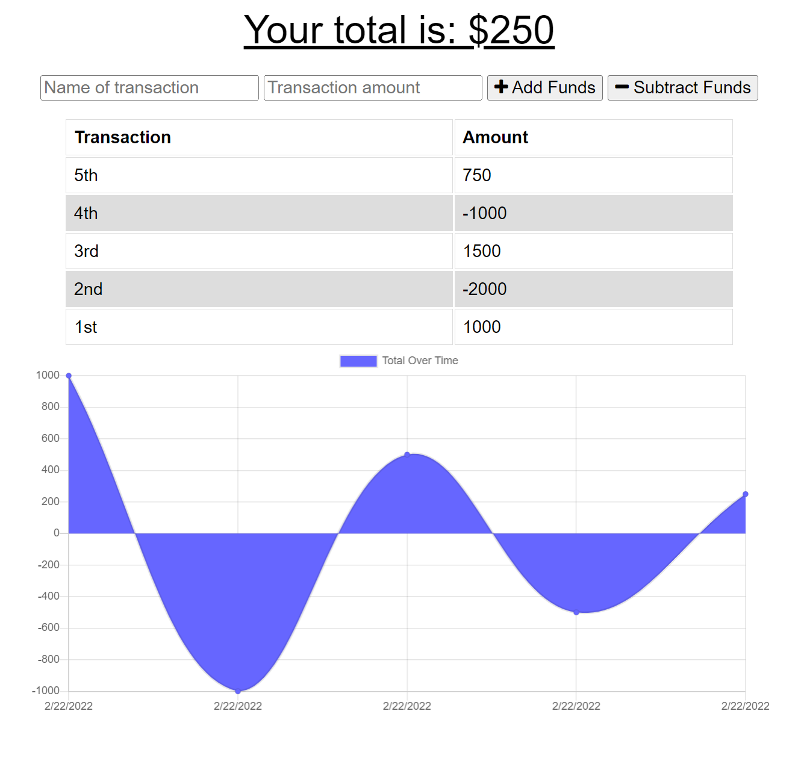
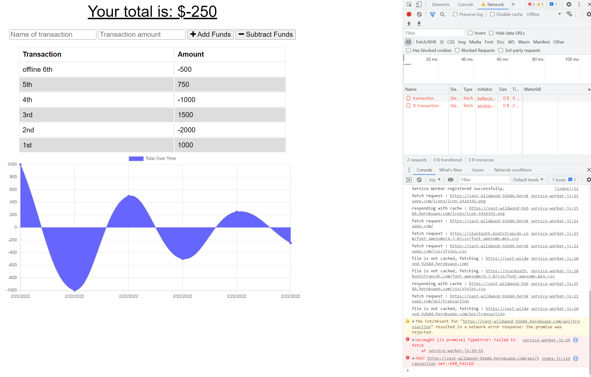
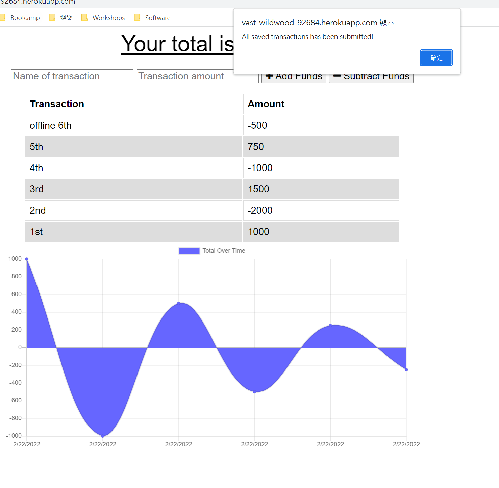

# Budget Tracker Starter Code

## Description

A Budget Tracker allow users to track their withdrawals and deposits online or offline.
Any offline transactions will update to DB when regain internet connection.

## Table of Contents

* [Installation](#installation)
* [Usage](#usage)
* [Features](#features)
* [Credits](#credits)
* [Results](#results)
* [Screenshots](#screenshots)

## Installation

To install necessary dependencies, run the following commands in command line:
npm i

## Usage

To use the application, run the following commands:
npm start

## Features

1. Add deposits or expenses
2. Add deposits or expenses offline
3. update after getting back online

## Credits

Third-Party Assets:
1. dotenv
2. MongoDB
3. Service Worker
4. Express

## Results

Application: https://vast-wildwood-92684.herokuapp.com/

Repository: https://github.com/pc611652003/Budget-Tracker

## Screenshot

After user go to the application, they are presented the homepage displaying all transactions

If user is using the application offline, it will still store all transactions.

After user get back online, all transactions made offline will push back up. A notification will signal user the completion.

